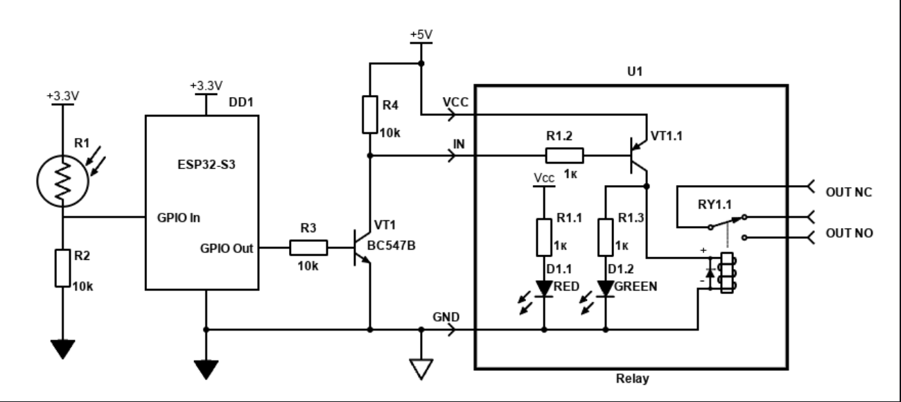

# Twilight Switch on ESP32-S3

[](https://github.com/YuriiKyiv/FirstEmbeddedProject/actions/workflows/build.yml)

Mini-project: connecting a sensor and an actuator to a microcontroller, plus debugging.

**Goal:** learn to read an analog signal from a voltage divider (ADC) and drive an
external load through a transistor switch (GPIO).

The firmware reads a photoresistor (LDR) through the ADC and switches a relay module
on when it gets dark and off when it gets light, with hysteresis so the relay does not
chatter around the threshold.

## Schematic



## Hardware

Assemble the circuit on a breadboard according to the schematic:

1. **Input (photoresistor).** Connect the divider R1 (LDR) + R2 (10 kΩ) to the +3.3V
   rail. Connect the midpoint of the divider to the ADC-capable input pin (`GPIO In`).
2. **Switch (3.3V -> 5V level shifting).** Connect `GPIO Out` through R3 (10 kΩ) to the
   base of the BC547B transistor (VT1). Pull the collector up to +5V through R4 (10 kΩ)
   and connect it to the `IN` pin of the relay module.
3. **Output (load).** Connect any safe low-voltage load (an LED, a 5V/12V LED strip) to
   the relay `OUT NO` contacts.

### Bill of materials

| Ref | Part                        | Note                                |
|-----|-----------------------------|-------------------------------------|
| DD1 | ESP32-S3-DevKitC-1          | Board                               |
| R1  | Photoresistor (LDR)         | Upper arm of the divider            |
| R2  | 10 kΩ                       | Lower arm of the divider            |
| R3  | 10 kΩ                       | Base resistor for VT1               |
| R4  | 10 kΩ                       | Collector pull-up to +5V            |
| VT1 | BC547B                      | NPN transistor switch               |
| U1  | Relay module, 5V            | Transistor input with LED indicator |

### Pin mapping

| Signal   | ESP32-S3 pin | Direction        |
|----------|--------------|------------------|
| GPIO In  | GPIO6        | Analog input     |
| GPIO Out | GPIO4        | Digital output   |

Pins are defined at the top of [src/main.cpp](src/main.cpp) as `SENSOR_PIN` and
`RELAY_PIN`.

## Firmware

The main loop performs three steps:

1. **Read** the ADC value from `GPIO In` (12-bit, range 0...4095).
2. **Compare** it against the thresholds (hysteresis):
   - `ADC < THRESHOLD_DARK` (dark) -> drive `GPIO Out` HIGH (relay on).
   - `ADC > THRESHOLD_LIGHT` (light) -> drive `GPIO Out` LOW (relay off).
   - Between the thresholds -> **change nothing**. This protects the relay from chatter.
3. **Wait** for the next sampling period.

### Implementation details

| Parameter          | Value | Meaning                                              |
|--------------------|-------|------------------------------------------------------|
| `THRESHOLD_DARK`   | 2200  | Below this the relay turns on                        |
| `THRESHOLD_LIGHT`  | 2900  | Above this the relay turns off                       |
| `EMA_ALPHA`        | 0.1   | Smoothing factor of the exponential moving average   |
| `LOOP_PERIOD_MS`   | 20    | Sensor sampling period                               |
| `LOG_PERIOD_MS`    | 100   | Period of Teleplot output over Serial                |

- The raw ADC reading is smoothed with an exponential moving average
  (`y = alpha * x + (1 - alpha) * y_prev`). With a 20 ms sampling period and
  `alpha = 0.1` the time constant is about 200 ms. The filter is seeded with a real
  reading at startup so it does not ramp up from zero.
- On startup the firmware prints a one-line diagnostic of the sensor pin with
  pull-down, pull-up and no pull, which helps to verify that the divider is wired
  correctly.
- Every relay state change is logged to Serial, for example
  `Dark  -> relay ON  (ADC = 2150)`.

### Debugging with Teleplot

Every 100 ms the firmware prints three variables in
[Teleplot](https://github.com/nesnes/teleplot) format:

```
>Raw:2345
>Filtered:2351
>Relay:0
```

Open the serial port at 115200 baud in the Teleplot VS Code extension to see the raw
signal, the filtered signal and the relay state as live plots.

## Building and flashing

The project uses [PlatformIO](https://platformio.org/).

```sh
# Build
pio run

# Upload to the board
pio run -t upload

# Serial monitor (115200 baud)
pio device monitor
```

The build environment is `esp32-s3-devkitc-1` (see [platformio.ini](platformio.ini)).

## Continuous integration

The [Build firmware](.github/workflows/build.yml) GitHub Actions workflow builds the
project on every push to `main`, on every pull request, and on manual dispatch.

What it does:

1. Checks out the repository and sets up Python.
2. Installs PlatformIO, with the PlatformIO platforms and packages cached between runs.
3. Runs `pio run -e esp32-s3-devkitc-1`.
4. Uploads the build output as a workflow artifact named
   `firmware-esp32-s3-devkitc-1-<commit sha>`, kept for 30 days.

The artifact contains:

| File             | Purpose                                   |
|------------------|-------------------------------------------|
| `firmware.bin`   | Application image                         |
| `bootloader.bin` | Second-stage bootloader                   |
| `partitions.bin` | Partition table                           |
| `firmware.elf`   | Unstripped binary for debugging           |

To flash a downloaded artifact without PlatformIO, use esptool:

```sh
esptool.py --chip esp32s3 --port /dev/ttyUSB0 write_flash \
  0x0    bootloader.bin \
  0x8000 partitions.bin \
  0x10000 firmware.bin
```

Artifacts can be downloaded from the **Actions** tab of the repository, in the details
of a workflow run.
